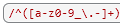
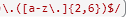
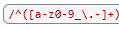
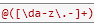
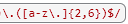
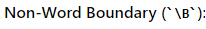
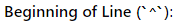
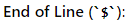

# Regex Tutorial: Email Validation

Validation is an important tool that is used in programming to ensure organization and consistancy with usernames, passwords, email adresses, URL's and HTML tags.

## Summary

In this tutorial we will be looking at the following Regular Exression (Regex) Email Validation that is used to check emails for minimum requirements when they are created.  

## Table of Contents

- [Anchors](#anchors)
- [Quantifiers](#quantifiers)
- [OR Operator](#or-operator)
- [Character Classes](#character-classes)
- [Flags](#flags)
- [Grouping and Capturing](#grouping-and-capturing)
- [Bracket Expressions](#bracket-expressions)
- [Greedy and Lazy Match](#greedy-and-lazy-match)
- [Boundaries](#boundaries)
- [Back-references](#back-references)
- [Look-ahead and Look-behind](#look-ahead-and-look-behind)

## Regex Components
Regular Expressions are broken down into many different components that represent diferent parts of the email string itself. These components set parameters for allowed letters, numbers and sprecial characters. Other paramaters like minimun and maximum characters allowed can also be difined in a Regex. To start this tutorial we can see thet the expression has to be wrapped in the forwared slash characer / since it is considered a literal.

### Anchors

After the Regex is wrapped we can move on to the Anchor characters. A ^ is used to signify that the characters that follow it will be accepted. We can see this in the local section of the email.  

Next we can see that the $ sign is used to mark the end of the exact string or range of possible character matches. We see this in the domain part of the email.  

### Quantifiers

Quantifiers are simply used to set the character limits for the string. With an Email Validation Regex there are different quantifiers used for the seperate sections of the email address. The first part or local section has + symbol that means the pattern can be matched 1 or more times. The {2,6} allows a minimum of 2 characters and a maximum of 6 characters. No more, no less. Here is a breakdown for the email Regex.  
Plus (+) quantifier for local section...  
  
Plus (+) quantifier for domain section...  
  
Curly bracket {} quantifier for domain section...  

### OR Operator

The pipeline symbol | is used to represent the OR operator which is used to further distnguish sub expressions for characters allowed. For example the sub expresseion (abc) can also be written as (a|b|c) which serve's the same function. 

### Character Classes

Character Classes simply define sets of characters that can occur anywhere in the input string.  \d, for example, will match any numeral digit 0-9.  Other character classes inclue...\w (Matches any Alphanumeric character inluding _ underscore [A-Za-z0]). \s (Matches a single whitspace character, including tabs and line breaks). Bracket expressions are also defined as character classes.

### Flags

Flags, which are placed after the 2nd / (slash) in a Regex, are used to define additional limits in the Regex. There are 6 options such as g (global search to compare all possible matches in a string), i (for case insensitive search) as well as m (for a multi-line search)

### Grouping and Capturing

Grouping in terms of Regex means that different parts of the Regex are seperated to further define what is allowed in which parts. Regular paranthesis () are used to break up the different sections. Grouping constructs can then be further differentiated by capturing and non-capturing categories.

### Bracket Expressions
Bracket Expressins are represented by the [] square brackets. Anything that is included inside the brackets will represent the range of characters that can be matched and included.  

### Greedy and Lazy Match

A greedy match means that the Regex will try and match as many occurences of the defined pattern as possible.  The * astericks will try and match the pattern zero or more times.  You may also use the {} curly brackets to set a minimun and maximum amount of times the pattern can be matched. When a  quantifier is made lazy it simply means that a ? quation mark will tell it to match as few instances as possible.

### Boundaries

Boundaries are used to further specify positions or transitions between characters in the string. Word Boundary (\b) is used to match where an actual word is placed next to a non-word. Other boundaries include ...  

  

  

### Back-references

These can be used to refer back to previously captured groups within the Regex pattern.  This can be done by by adding \1 or \2 and so on to refer back to a particular captured group.

### Look-ahead and Look-behind

These advanced features also known as zero-width assertions can be used to define wheather a pattern is preceded or followed by another patern. Look-ahead can be broken down into 2 components (Positive and negative) which specifies what will and will not be matched.

## Author

Thid article was written by Eli Ruiz  
github: https://github.com/blitzbomber87